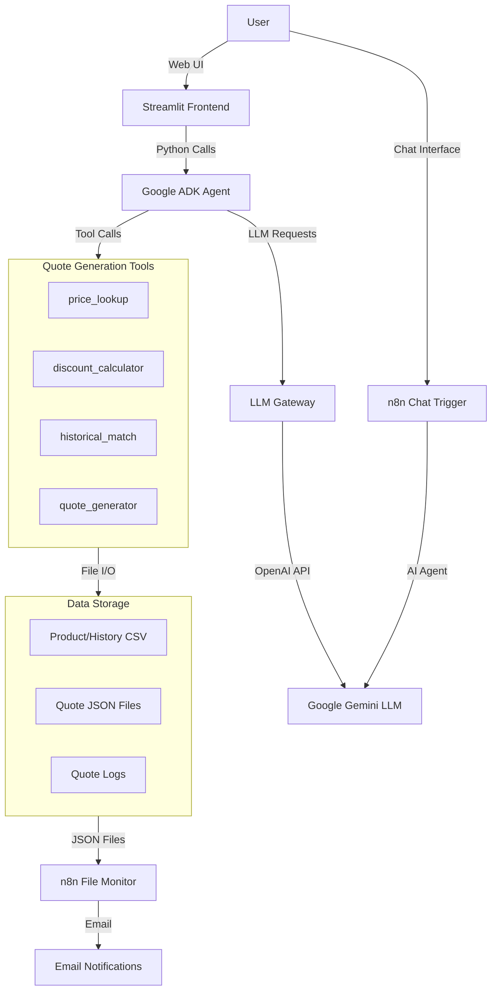
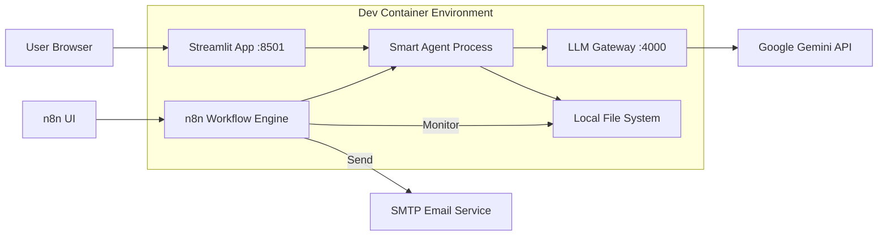
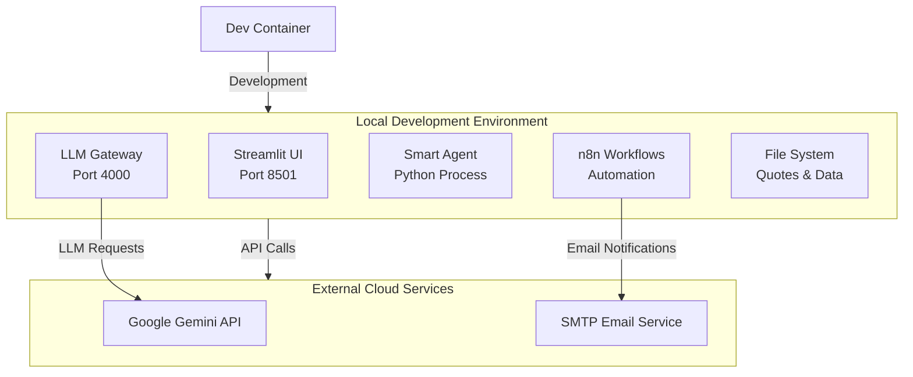

# AgentX Hackathon - Smart Quoting Agent Architecture

## 1. Introduction

This document describes the architectural design for the Smart Quoting Agent project, a comprehensive AI-powered quote generation system using Google ADK framework, LLM Gateway integration, n8n workflow automation, and Streamlit web interface.

---

## 2. Logical Architecture



- **Streamlit Frontend:** Web-based UI for interactive quote generation
- **Google ADK Agent:** Core AI agent using Google's Agent Development Kit
- **LLM Gateway:** Proxy service for LLM API calls (localhost:4000)
- **Quote Tools:** Specialized functions for pricing, discounts, and quote generation
- **n8n Workflow:** Automation for file monitoring and email notifications
- **File System:** CSV data storage and JSON quote output

---

## 3. Physical Architecture



- **Dev Container:** Debian-based development environment with all dependencies
- **Streamlit App:** Web interface running on port 8501
- **LLM Gateway:** Local proxy service on port 4000
- **File System:** Local storage for quotes and data files
- **n8n Workflow:** Automated monitoring and notification system
- **External APIs:** Google Gemini LLM service

---

## 4. Deployment Architecture



- **Development Environment:** All services run locally in dev container
- **Local File Storage:** Quotes and data stored in workspace filesystem
- **Cloud Integration:** External APIs for LLM and email services
- **Automated Workflows:** n8n handles file monitoring and notifications

---

## 5. Components and Technologies

| Component | Technology | Purpose | Port/Location |
|-----------|------------|---------|---------------|
| **Frontend UI** | Streamlit | Interactive web interface | :8501 |
| **AI Agent** | Google ADK + Python | Core quote generation logic | Python process |
| **LLM Gateway** | OpenAI-compatible proxy | LLM API abstraction | :4000 |
| **LLM Service** | Google Gemini 2.5 Flash | Large language model | Cloud API |
| **Workflow Engine** | n8n | Automation and monitoring | Workflow process |
| **Data Storage** | CSV + JSON files | Product catalog and quotes | File system |
| **Email Service** | SMTP | Quote notifications | Cloud SMTP |
| **Development** | Dev Container | Debian-based environment | Container |

---

## 6. Data Flow

### Quote Generation Process:

1. **User Input:** Request via Streamlit UI or n8n chat
2. **Agent Processing:** Google ADK agent processes request
3. **Tool Execution:** Sequential tool calls:
   - `price_lookup()` - Get product pricing
   - `discount_calculator()` - Calculate discounts
   - `quote_generator()` - Create and save quote
4. **File Creation:** JSON quote file saved to filesystem
5. **Monitoring:** n8n detects new quote files
6. **Notification:** Email sent with quote details

### File Structure:
```
/workspaces/agentx-hackathon-DC-Pros/
├── aef-samples/google-adk/
│   ├── simple_agent.py          # Core agent logic
│   ├── streamlit_app.py         # Web UI
│   ├── data/
│   │   ├── products.csv         # Product catalog
│   │   ├── historical_quotes.csv
│   │   └── quotes_log.csv
│   └── quotes/                  # Generated quote files
├── n8n/
│   └── workflows/
│       └── smart-quote-monitor.json
└── quotes/                      # Quote output directory
```

---

## 7. Integration Points

### **Google ADK Integration:**
- Custom `LLMGatewayModel` class bridges ADK with LLM Gateway
- Tool functions registered with ADK framework
- Session management for conversation context

### **LLM Gateway Integration:**
- OpenAI-compatible API format
- Async request handling
- Tool call detection and execution

### **n8n Integration:**
- File system monitoring via command execution
- Email template processing
- Workflow static data for tracking processed files

### **Streamlit Integration:**
- Real-time chat interface
- File browser and download functionality
- Session state management for conversation history

---

## 8. Security and Configuration

- **API Keys:** Managed via environment variables
- **File Permissions:** Controlled access to quote directories
- **HTTPS:** SSL/TLS for external API communications
- **Email Security:** SMTP authentication for notifications

---

## 9. Scalability Considerations

- **Async Processing:** Non-blocking LLM requests
- **File-based Storage:** Simple and reliable for development
- **Modular Tools:** Easy to extend with additional quote functions
- **Workflow Automation:** n8n handles background processing

---

## 10. Development Workflow

1. **Code Changes:** Edit agent logic or UI components
2. **Testing:** Run agent directly or via Streamlit
3. **Quote Generation:** Tools create JSON files automatically
4. **Monitoring:** n8n workflows detect and process new quotes
5. **Notifications:** Email alerts sent for new quotes

---

## 11. Contact

For architectural questions or development support, contact the AgentX Hackathon team.
