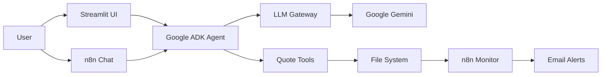

# 🎯 Smart Quoting Agent - AgentX Hackathon

An AI-powered quote generation system built with Google ADK framework, featuring automated workflows and real-time notifications.

## 🚀 Features

- **🤖 AI-Powered Quotes:** Google Gemini LLM with specialized tools
- **💬 Interactive UI:** Streamlit web interface for easy quote generation
- **📧 Auto Notifications:** n8n workflows for email alerts
- **🔧 Tool Integration:** Price lookup, discount calculation, and quote generation
- **📊 Real-time Dashboard:** Quote statistics and file management
- **🔄 Workflow Automation:** File monitoring and processing

## 🏗️ Architecture



## 📁 Project Structure

```
/workspaces/agentx-hackathon-DC-Pros/
├── 📂 aef-samples/google-adk/
│   ├── 🐍 simple_agent.py          # Core AI agent
│   ├── 🌐 streamlit_app.py         # Web interface
│   ├── 🚀 run_app.sh              # Launch script
│   ├── 📊 data/
│   │   ├── products.csv            # Product catalog
│   │   ├── historical_quotes.csv   # Quote history
│   │   └── quotes_log.csv          # Generated quotes log
│   └── 📄 quotes/                  # Output directory
├── 🔧 n8n/
│   └── workflows/
│       └── smart-quote-monitor.json # Automation workflow
├── 📋 quotes/                       # Alternative output
├── 📖 ARCHITECTURE.md              # Detailed architecture
└── 📝 README.md                   # This file
```

## 🛠️ Setup & Installation

### Prerequisites

- Python 3.8+
- Node.js (for n8n)
- Google ADK framework
- LLM Gateway running on port 4000

### Quick Start

1. **Clone and Navigate:**
   ```bash
   cd /workspaces/agentx-hackathon-DC-Pros/aef-samples/google-adk
   ```

2. **Install Dependencies:**
   ```bash
   pip install streamlit pandas openai google-adk
   ```

3. **Start LLM Gateway:**
   ```bash
   # Ensure LLM Gateway is running on localhost:4000
   ```

4. **Launch Streamlit UI:**
   ```bash
   ./run_app.sh
   # OR
   streamlit run streamlit_app.py
   ```

5. **Access Application:**
   - Web UI: `http://localhost:8501`
   - Start generating quotes!

## 💬 Usage Examples

### Quick Quote Generation

**Via Streamlit UI:**
- Open `http://localhost:8501`
- Use sample prompts or enter custom requests
- View generated quotes in real-time

**Sample Prompts:**
```
Create a quote for 120 Office Chairs for ABC Corp, preferred customer
```

```
Generate quote for TechStart Inc (regular customer): 50 Office Chairs and 10 Conference Tables
```

### Available Products

| Product | Unit Price | Tier |
|---------|------------|------|
| Office Chair | $1,500 | Standard |
| Conference Table | $12,000 | Premium |
| Developer Desk | $8,000 | Standard |
| Visitor Stool | $900 | Basic |

### Discount Tiers

- **50-99 items:** 5% discount
- **100+ items:** 10% discount
- **Preferred customers:** Additional 5% discount

## 🔧 Components

### 1. Smart Agent (`simple_agent.py`)

Core AI agent with Google ADK integration:

- **Custom LLM Gateway Model:** Bridges ADK with LLM Gateway
- **Tool Functions:**
  - `price_lookup()` - Product catalog search
  - `discount_calculator()` - Tiered pricing
  - `historical_match()` - Past quote analysis
  - `quote_generator()` - JSON file creation

### 2. Streamlit UI (`streamlit_app.py`)

Web-based interface featuring:

- **Interactive Chat:** Real-time conversation with agent
- **Dashboard:** Statistics and recent quotes
- **File Browser:** View and download quote files
- **Quick Actions:** Pre-defined sample prompts

### 3. n8n Workflow (`smart-quote-monitor.json`)

Automation pipeline:

- **File Monitoring:** Detects new quote files
- **Email Notifications:** Formatted quote alerts
- **Chat Interface:** Alternative input method
- **Processing Logic:** Handles duplicates and errors

## 📧 Email Notifications

Automatic email alerts include:

- Quote ID and customer information
- Itemized product breakdown
- Total pricing with discounts
- Terms and conditions
- Professional HTML formatting

## 🎯 Demo Workflow

1. **User Request:** "Create a quote for 120 Office Chairs for ABC Corp, preferred customer"

2. **Agent Processing:**
   - Calls `price_lookup("Office Chair")` → Gets $1,500 unit price
   - Calls `discount_calculator(1500, 120, "preferred")` → 15% discount
   - Calls `quote_generator()` → Creates JSON file

3. **File Output:**
   ```json
   {
     "quote_id": "Q-ABC123",
     "customer": "ABC Corp",
     "items": [
       {
         "name": "Office Chair",
         "qty": 120,
         "unit_price": 1500,
         "total": 153000
       }
     ],
     "subtotal": 180000,
     "total": 153000,
     "terms": "Standard T&C apply."
   }
   ```

4. **Automation:** n8n detects file and sends email notification

## 🔍 Troubleshooting

### Common Issues

**No quotes generated:**
- Check LLM Gateway is running on port 4000
- Verify Google ADK installation
- Check file permissions for quotes directory

**Streamlit errors:**
- Ensure all dependencies installed: `pip install -r requirements.txt`
- Check Python version compatibility

**Email notifications not working:**
- Verify SMTP credentials in n8n
- Check workflow is activated
- Confirm file path monitoring

### Debug Mode

Enable detailed logging:
```bash
export DEBUG=1
python simple_agent.py
```

## 🚀 Development

### Adding New Products

Edit `data/products.csv`:
```csv
sku,name,unit_price,tier
NEW-001,New Product,5000,premium
```

### Custom Tools

Add new functions to `simple_agent.py`:
```python
def new_tool(parameter: str) -> dict:
    """Custom tool functionality"""
    return {"result": "success"}

# Register with tools list
tools = [..., new_tool]
```

### UI Customization

Modify Streamlit interface in `streamlit_app.py`:
- Update CSS styling
- Add new components
- Modify layout structure

## 📊 Performance

- **Response Time:** 2-5 seconds per quote
- **Concurrent Users:** Supports multiple Streamlit sessions
- **File Storage:** Unlimited quotes (JSON format)
- **Email Delivery:** Near real-time notifications

## 🛡️ Security

- Environment variables for API keys
- Local file system storage
- HTTPS for external API calls
- Input validation and sanitization

## 🤝 Contributing

1. Fork the repository
2. Create feature branch: `git checkout -b feature/new-feature`
3. Commit changes: `git commit -am 'Add new feature'`
4. Push to branch: `git push origin feature/new-feature`
5. Submit pull request

## 📄 License

This project is part of the AgentX Hackathon and is intended for demonstration purposes.

## 🎉 AgentX Hackathon Team

Built with ❤️ for the AgentX Hackathon - demonstrating the power of AI agents, workflow automation, and modern web interfaces.

---

**Ready to generate some quotes? 🚀**

Start with: `./run_app.sh` and visit `http://localhost:8501`