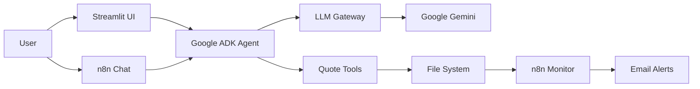

# 🎯 Smart Quoting Agent - AgentX Hackathon

An AI-powered quote generation system built with Google ADK framework, featuring automated workflows and real-time notifications.

## 🚀 Features

- **🤖 AI-Powered Quotes:** Google Gemini LLM with specialized tools
- **💬 Interactive UI:** Streamlit web interface for easy quote generation
- **📧 Auto Notifications:** n8n workflows for email alerts
- **🔧 Tool Integration:** Price lookup, discount calculation, and quote generation
- **📊 Real-time Dashboard:** Quote statistics and file management
- **🔄 Workflow Automation:** File monitoring and processing

## 🏗️ Architecture


```mermaid
graph LR
    A[User] --> B[Streamlit UI]
    A --> C[n8n Chat]
    B --> D[Google ADK Agent]
    C --> D
    D --> E[LLM Gateway]
    E --> F[Google Gemini]
    D --> G[Quote Tools]
    G --> H[File System]
    H --> I[n8n Monitor]
    I --> J[Email Alerts]
```

## 📁 Project Structure

```
Quote-Agent/
├── 📂 src/                            # All Python source modules
│   ├── simple_agent.py                # Core AI agent (Google ADK)
│   ├── streamlit_app.py               # Web interface
│   ├── multi_agent_quote.py           # Supervisor pipeline
│   ├── langgraph_orchestrator.py      # LangGraph pipeline
│   ├── llm_extractor.py              # Structured LLM parsing (Pydantic)
│   ├── product_discovery.py          # RAG product search
│   ├── rag_retriever.py              # Historical quote retrieval
│   ├── quote_storage.py              # Data repository (CSV/PostgreSQL)
│   ├── guardrails.py                 # Safety & policy checks
│   ├── approval_queue.py             # Human-in-the-loop approval
│   ├── observability.py              # Telemetry & tracing
│   └── ingest_products.py            # Product catalog ingestion
│
├── 📂 tests/                          # Testing & evaluation
│   ├── evaluate_quotes.py            # Evaluation framework (12 metrics)
│   ├── test_quoting_agent.py         # Agent integration tests
│   └── test_cases.json               # 15 test scenarios
│
├── 📂 data/                           # Data files
│   ├── products.csv                   # Product catalog (enriched)
│   ├── historical_quotes.csv          # Quote history
│   └── quotes_log.csv                 # Generated quotes log
│
├── 📂 scripts/                        # Shell scripts
│   ├── run_app.sh                     # Full launch script
│   └── run_streamlit.sh               # Streamlit-only launcher
│
├── 📂 notebooks/                      # Jupyter notebooks
│   └── agent_demo.ipynb               # Interactive demo
│
├── 📂 examples/                       # Reference examples
│   ├── deval/                         # DeepEval demo
│   ├── langgraph/                     # LangGraph sample
│   ├── llmgateway/                    # LLM Gateway tutorial
│   └── n8n/                           # n8n sample agent
│
├── 📂 configs/                        # Configuration
│   └── config.yaml                    # LiteLLM model config
│
├── 📂 n8n/                            # n8n automation
│   └── workflows/
│       └── smart-quote-monitor.json
│
├── 📂 quotes/                         # Generated quote output
├── 📂 demo/                           # Demo recording
│
├── requirements.txt                   # Python dependencies
├── compose.yaml                       # Docker Compose
├── ARCHITECTURE.md                    # Detailed architecture doc
├── .gitignore
└── README.md
```

## 🛠️ Setup & Installation

### Prerequisites

- Python 3.8+
- Node.js (for n8n)
- Google ADK framework
- LLM Gateway running on port 4000

### Quick Start

1. **Clone and Navigate:**
   ```bash
   git clone https://github.com/akmalvk6/Quote-Agent.git
   cd Quote-Agent
   ```

2. **Install Dependencies:**
   ```bash
   pip install -r requirements.txt
   ```

3. **Ingest Products into Vector Store:**
   ```bash
   python src/ingest_products.py
   ```

4. **Start LLM Gateway:**
   ```bash
   # Ensure LLM Gateway is running on localhost:4000
   ```

5. **Launch Streamlit UI:**
   ```bash
   bash scripts/run_app.sh
   # OR
   cd src && streamlit run streamlit_app.py
   ```

6. **Access Application:**
   - Web UI: `http://localhost:8501`
   - Start generating quotes!

## 💬 Usage Examples

### Quick Quote Generation

**Via Streamlit UI:**
- Open `http://localhost:8501`
- Use sample prompts or enter custom requests
- View generated quotes in real-time

**Sample Prompts:**
```
Create a quote for 120 Office Chairs for ABC Corp, preferred customer
```

```
Generate quote for TechStart Inc (regular customer): 50 Office Chairs and 10 Conference Tables
```

### Available Products

| Product | Unit Price | Tier |
|---------|------------|------|
| Office Chair | $1,500 | Standard |
| Conference Table | $12,000 | Premium |
| Developer Desk | $8,000 | Standard |
| Visitor Stool | $900 | Basic |

> 💡 Products include rich metadata (category, description, features, use cases, keywords) for semantic search. See `data/products.csv` for full details.

### Discount Tiers

- **50-99 items:** 5% discount
- **100+ items:** 10% discount
- **Preferred customers:** Additional 5% discount

## 🔧 Components

### 1. Smart Agent (`simple_agent.py`)

Core AI agent with Google ADK integration:

- **Custom LLM Gateway Model:** Bridges ADK with LLM Gateway
- **Structured LLM Extraction:** Uses Gemini structured output + Pydantic validation (no regex)
- **Tool Functions:**
  - `price_lookup()` - Product catalog search
  - `find_similar_product()` - Semantic product discovery with confidence tiers
  - `discount_calculator()` - Tiered pricing
  - `historical_match()` - Past quote analysis
  - `quote_generator()` - JSON file creation

### 2. LLM Extractor (`llm_extractor.py`)

Replaces brittle regex parsing with structured LLM extraction:

- **Gemini Structured Output:** Uses `response_mime_type="application/json"` with a JSON schema
- **Pydantic Validation:** `QuoteRequest` model validates quantity, product, customer, customer_type
- **Regex Fallback:** Automatic fallback to regex if Gemini API is unavailable
- **Handles natural language:** "Hi, we need about 30 standing desks for our new office" ✅

### 2. Streamlit UI (`streamlit_app.py`)

Web-based interface featuring:

- **Interactive Chat:** Real-time conversation with agent
- **Dashboard:** Statistics and recent quotes
- **File Browser:** View and download quote files
- **Quick Actions:** Pre-defined sample prompts

### 3. n8n Workflow (`smart-quote-monitor.json`)

Automation pipeline:

- **File Monitoring:** Detects new quote files
- **Email Notifications:** Formatted quote alerts
- **Chat Interface:** Alternative input method
- **Processing Logic:** Handles duplicates and errors

## 📧 Email Notifications

Automatic email alerts include:

- Quote ID and customer information
- Itemized product breakdown
- Total pricing with discounts
- Terms and conditions
- Professional HTML formatting

## 🎯 Demo Workflow

1. **User Request:** "Create a quote for 120 Office Chairs for ABC Corp, preferred customer"

2. **Agent Processing:**
   - Calls `price_lookup("Office Chair")` → Gets $1,500 unit price
   - Calls `discount_calculator(1500, 120, "preferred")` → 15% discount
   - Calls `quote_generator()` → Creates JSON file

3. **File Output:**
   ```json
   {
     "quote_id": "Q-ABC123",
     "customer": "ABC Corp",
     "items": [
       {
         "name": "Office Chair",
         "qty": 120,
         "unit_price": 1500,
         "total": 153000
       }
     ],
     "subtotal": 180000,
     "total": 153000,
     "terms": "Standard T&C apply."
   }
   ```

4. **Automation:** n8n detects file and sends email notification

### 🔍 Semantic Product Discovery

When a product isn't found by exact name:

1. **User Request:** "Create a quote for 10 study tables for StudentCo"

2. **Agent Processing:**
   - Calls `price_lookup("study table")` → Not found
   - Calls `find_similar_product("study table")` → Developer Desk (85%+ match)
   - Auto-selects and informs user: "No exact match. Using Developer Desk."
   - Continues with standard pricing and quote generation

3. **Confidence Tiers:**
   - **Score ≥ 85%:** Auto-select — quote generated automatically
   - **Score 70–84%:** Ask user — "Did you mean: 1. Developer Desk, 2. Conference Table?"
   - **Score < 70%:** Reject — "No matching product found"

4. **Quote Output includes discovery metadata:**
   ```json
   {
     "requested_product": "study table",
     "matched_product": "Developer Desk",
     "match_score": 0.92
   }
   ```
## 📊 Evaluation Framework

Run the comprehensive evaluation suite:

```bash
python tests/evaluate_quotes.py
```

### Metrics (12 metrics across 4 categories)

#### A. Core Pipeline Metrics
| Metric | Description |
|--------|-------------|
| **Task Success Rate** | Fraction of requests that produce a valid quote (or correctly error) |
| **E2E Quote Accuracy** | All fields (product, qty, customer, price, discount) correct |
| **Approval Escalation Rate** | How often guardrails trigger human approval |
| **Avg Latency** | Mean pipeline execution time in milliseconds |

#### B. Product Matching Metrics
| Metric | Description |
|--------|-------------|
| **Product Match Accuracy** | Correct product resolved (exact + semantic) |
| **Hallucination Rate** | Products invented by the agent that don't exist in the catalog |

#### C. Retrieval Quality Metrics (RAG)
| Metric | Description |
|--------|-------------|
| **Precision@K** | Fraction of top-K retrieved products that are relevant |
| **Recall@K** | Fraction of all relevant products appearing in top-K |
| **MRR** | Mean Reciprocal Rank — how quickly the correct product appears |
| **Retrieval Precision** | Top-1 retrieval correctness |

#### D. Agent Behavior Metrics
| Metric | Description |
|--------|-------------|
| **Tool Call Accuracy** | Correct agent/tool sequence executed |
| **Parsing Accuracy** | LLM extraction correctly parsed qty, product, customer |

### Test Suite

15 test cases covering:
- ✅ Exact product matches (4 cases)
- 🔍 Semantic product discovery (3 cases)
- ❌ No-match products (2 cases)
- ⚠️ Missing fields — quantity, customer (2 cases)
- 🛡️ Guardrail triggers — injection, excessive qty (2 cases)
- 💬 Natural language variations (2 cases)

## 🔍 Troubleshooting

### Common Issues

**No quotes generated:**
- Check LLM Gateway is running on port 4000
- Verify Google ADK installation
- Check file permissions for quotes directory

**Streamlit errors:**
- Ensure all dependencies installed: `pip install -r requirements.txt`
- Check Python version compatibility

**Email notifications not working:**
- Verify SMTP credentials in n8n
- Check workflow is activated
- Confirm file path monitoring

### Debug Mode

Enable detailed logging:
```bash
cd src
export DEBUG=1
python simple_agent.py
```

## 🚀 Development

### Adding New Products

Edit `data/products.csv`:
```csv
sku,name,unit_price,tier
NEW-001,New Product,5000,premium
```

### Custom Tools

Add new functions to `src/simple_agent.py`:
```python
def new_tool(parameter: str) -> dict:
    """Custom tool functionality"""
    return {"result": "success"}

# Register with tools list
tools = [..., new_tool]
```

### UI Customization

Modify Streamlit interface in `src/streamlit_app.py`:
- Update CSS styling
- Add new components
- Modify layout structure

## 📊 Performance

- **Response Time:** 2-5 seconds per quote
- **Concurrent Users:** Supports multiple Streamlit sessions
- **File Storage:** Unlimited quotes (JSON format)
- **Email Delivery:** Near real-time notifications

## 🛡️ Security

- Environment variables for API keys
- Local file system storage
- HTTPS for external API calls
- Input validation and sanitization

## 🤝 Contributing

1. Fork the repository
2. Create feature branch: `git checkout -b feature/new-feature`
3. Commit changes: `git commit -am 'Add new feature'`
4. Push to branch: `git push origin feature/new-feature`
5. Submit pull request

## 📄 License

This project is part of the AgentX Hackathon and is intended for demonstration purposes.

## 🎉 AgentX Hackathon Team

Built with ❤️ for the AgentX Hackathon - demonstrating the power of AI agents, workflow automation, and modern web interfaces.

---

**Ready to generate some quotes? 🚀**

Start with: `bash scripts/run_app.sh` and visit `http://localhost:8501`